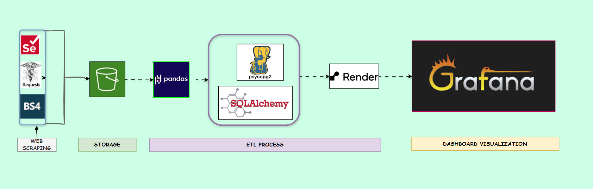
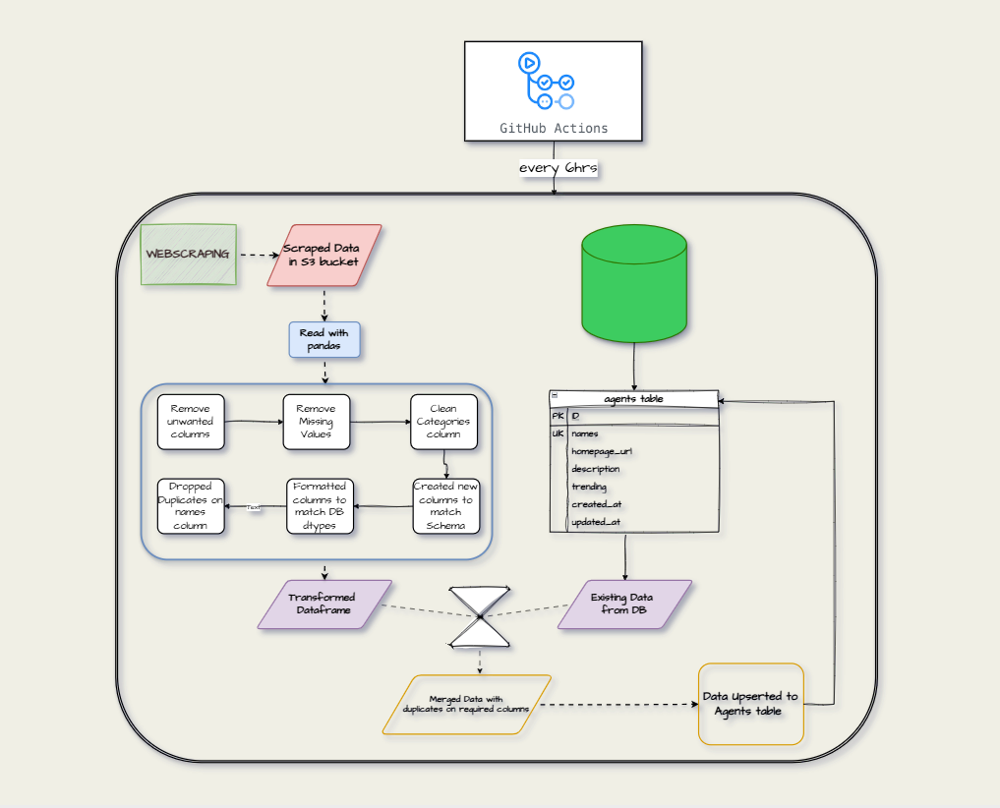
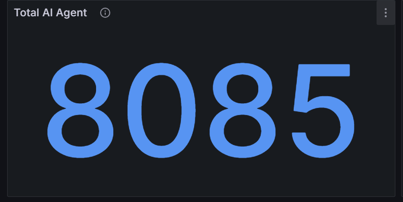
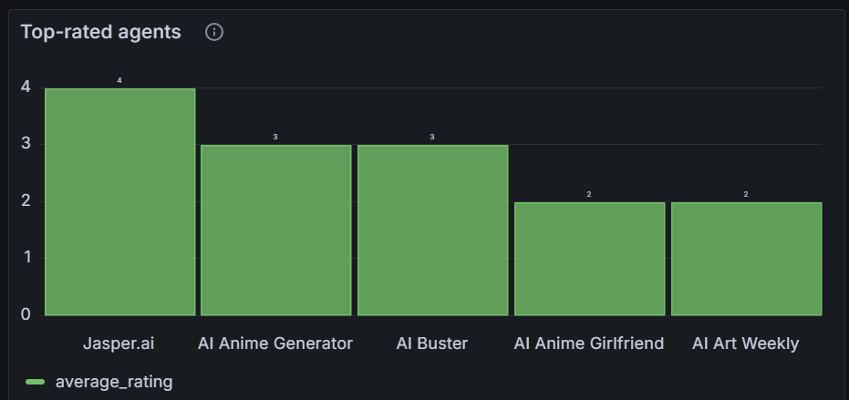
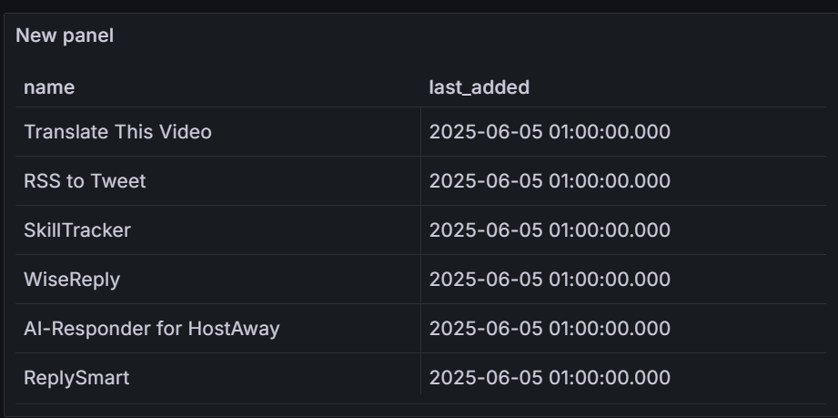
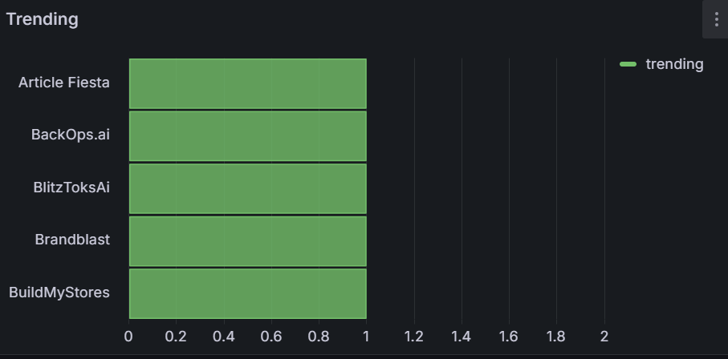
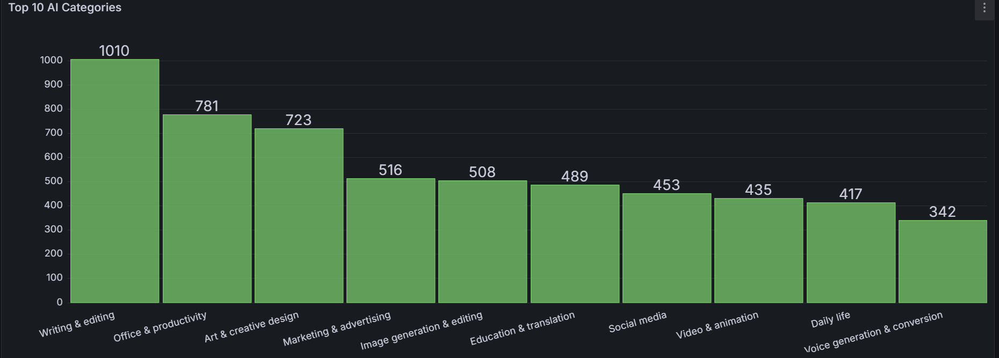

# 🧠 AI Agent Directory - Data Engineering

This repository contains the **Data Engineering** logic for the **AI Agent Directory MVP**, a backend-first platform that aggregates, processes, and serves AI agent metadata to users and admins. The DE component is responsible for scraping, ingesting, transforming, validating, and persisting agent data into a PostgreSQL database with support for automation, analytics, and robust testing.

---

## 🔧 Tech Stack & Architecture


## 🔧 Flow Chart Architecture


### 🔁 Data Flow

1. **Web Scraping**
   - Technologies: `Selenium`, `Requests`, `BeautifulSoup (BS4)`
   - Scrapes AI tools from multiple public sources.

2. **Storage**
   - Dump scraped files to AWS S3 using `boto3`.

3. **ETL Process**
   - Extract latest scraped ai_agents csv data from AWS S3 using `boto3`.
   - Processes and transforms data using `Pandas`
   - Connects to PostgreSQL via `SQLAlchemy` and `psycopg2`
   - Deduplicates and upserts records

4. **Deployment**
   - Hosted on **Render**
   - Ingestion jobs can be triggered manually or scheduled via GitHub Actions

---

## 📁 Folder Structure

```
etl/
├── data/                    # Processed or incoming files
├── downloads/              # Raw CSV/JSON from scraping
├── logs/                   # Log outputs from ETL/scraper
├── notebooks/              # Dev notebooks for EDA/testing
├── pictures/               # Diagrams, screenshots
├── tests/                  # Unit tests for ETL logic
│   ├── __init__.py
│   └── test_etl_job.py
├── utils/                  # Reusable helper modules
│   ├── logger_config.py
│   ├── models.py           # Functions for database connection and upserts using SQLAlchemy and Psycopg2
│   └── utils.py
├── idempotent_etl.py       # Main ETL runner (idempotent logic)
├── load_seed_data.py       # Seeds initial 50+ agent entries
├── web_scraper.py          # Production scraping script
└── __init__.py
```

---

## 🚀 Setup & Usage

### 1. Install Requirements

```bash
pip install -r requirements.txt
```

### 2. Configure Environment

Create a `.env` file in the root directory with the following:

```env
DATABASE_URL=postgresql://<user>:<password>@<host>:<port>/ai_directory_db
AWS CREDENTIALS
```

---

## 🔁 Core ETL Components

### 🧼 Idempotent ETL Job

Run this to ingest a CSV/JSON/Parquet file:

```bash
poetry run python etl/idempotent_etl.py --file etl/downloads/agents.csv
```

- Ensures duplicates are skipped (based on `LOWER(name)` and `homepage_url`)
- Inserts or updates records cleanly
- Logs all actions to `/logs`

### 🧲 Load Seed Data

Run once to populate the database with >50 agents across 5 categories:

```bash
poetry run python etl/load_seed_data.py
```

---

## 🕷️ Web Scraping

Extract AI agents from public listings or mock sources:

```bash
poetry run python etl/web_scraper.py
```

- Detects categories using rules or mapping
- Outputs to `etl/downloads/` and loads loads directly into PostGres DB on Render

---

## 🔄 Scheduled Automation

Automated ingestion can be triggered via:

- **GitHub Actions** (CI cron job): Every 6 hours
- **Docker-based Cron** (local cron jobs inside container)

Logs are captured to `etl/logs/` for diagnostics.

---

## 📊 Analytics Support

The following SQL views or endpoints can be generated from the ingested data:

- **Total Agents**

- **Top-Rated Agents**

- **Recently Added**

- **Trending Agents** 

- **Top AI Categories**


---

## 🧪 Testing

Unit tests ensure ETL quality and logic correctness:

```bash
pytest etl/tests/
```

Covers:
- Deduplication logic
- Invalid record handling
- ETL job correctness
- Category mapping tests

---

## ⚙️ CI/CD Integration

The ETL scripts are tested and deployed using **GitHub Actions**, ensuring:

- Tests are run on every push
- Scheduled jobs execute ingestion pipelines
- Alerts/logs are emitted for failures

---

## 🧑‍💻 Team - Data Engineering

- [Damilola Adeniyi: Team Lead]
- [Arowosegbe Victor]

See the Software Engineering `README.md` for API-related work.

---

## 📫 Contact & Contributions
Contact us at:
```
adeniyidamilola246@gmail.com
iyanuvicky@gmail.com
```

---
## 📝 License
